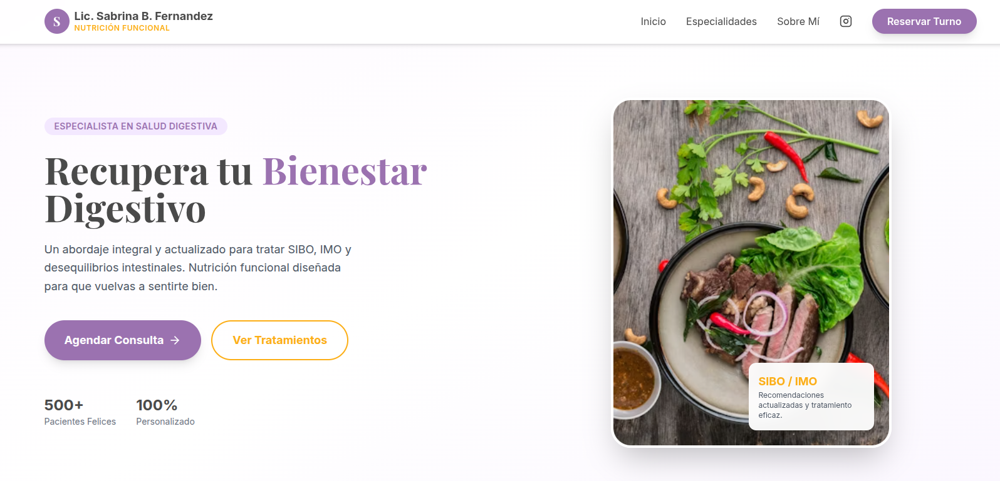

  

# Lic. Sabrina B. Fernandez — Nutrición Funcional

Bienvenido/a al sitio profesional de la Lic. Sabrina B. Fernandez, especialista en nutrición funcional y salud digestiva. Aquí encontrarás recursos gratuitos, información sobre abordajes personalizados, recetas antiinflamatorias, acceso a turnos online y una selección de videos y charlas educativas sobre bienestar integral.

## ¿Qué encontrarás en este proyecto?

- **Recursos gratuitos**: Descarga recetas antiinflamatorias y guías prácticas.
- **Solicitar turno online**: Agenda tu consulta de manera rápida por WhatsApp.
- **Ubicación del consultorio**: Atención presencial en Adrogué, Buenos Aires.
- **Videos y charlas**: Acceso a vivos, masterclass y colaboraciones sobre salud, nutrición y bienestar.
- **Abordaje integral**: Información sobre tratamientos para SIBO, IMO, disbiosis y más.

## Cómo ejecutar el proyecto localmente

**Requisitos:** Node.js

1. Instala las dependencias:
   `npm install`
2. Ejecuta la app:
   `npm run dev`

---
¡Explora, aprende y da el primer paso hacia tu bienestar digestivo!
